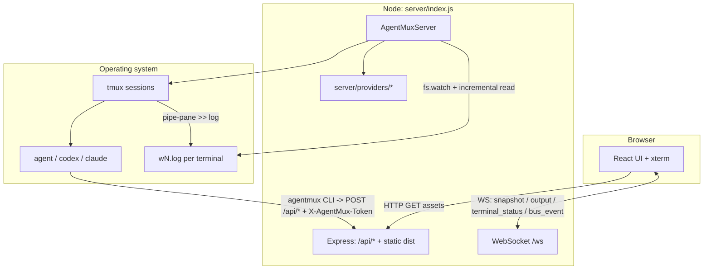

# AgentMux Project Architecture

[English](Project_Architecture.md) · [简体中文](Project_Architecture.zh-CN.md)

This document describes the **actual implementation** in this repository
(`agentmux`): multi-terminal orchestration built on Node.js, tmux, WebSocket and
React/xterm, running Cursor Agent, Codex CLI and Claude Code side by side. For
product-level background see
[`AgentMux_Technical_Architecture_Documentation.md`](./AgentMux_Technical_Architecture_Documentation.md);
this document defers to the **code and directory layout**.

---

## 1. What it is

AgentMux serves a browser UI that:

- Creates a **Project** per workspace directory, each holding several
  **Terminals** (one **tmux session** each).
- Starts an **agent CLI** in each terminal with a configurable **bootstrap
  instruction**. **The CLI and model are chosen per terminal** — one project can
  run one pane on Claude, another on Codex, another on Cursor.
- Streams terminal output to **xterm.js** over **WebSocket**, and accepts agent
  reports over an **HTTP API**, forming an **event bus** for cross-terminal
  collaboration.

Assumes **tmux is installed** and at least one agent CLI resolves on `PATH`
(`agent` / `codex` / `claude`, or a path given via environment variable).

No native modules, so macOS and Linux both work.

---

## 2. Stack

| Layer | Technology |
|-------|-----------|
| Frontend | React 19, Vite 8, xterm.js 5, xterm-addon-fit |
| Backend | Node.js ≥18, Express 4, `ws` |
| Process orchestration | `tmux` (`new-session`, `send-keys`, `capture-pane`, `pipe-pane`, `display-message`, `kill-session`) |
| Output streaming | `fs.watch` plus an 80ms poll, reading each terminal's log incrementally with `fs.readSync` |
| Static assets | Express serves `dist/` in production (`npm run build` output) |

---

## 3. High-level architecture



**Key points:**

- **Live output**: pane output is piped into a log file; the server forwards
  only **new bytes** (a full replay would corrupt an alt-screen TUI).
- **Only to whoever is watching**: `output` messages go only to clients
  **subscribed to that terminal** (§7).
- **Repaint on switch/refresh**: `tmux capture-pane -p -e -J` yields the current
  frame with ANSI intact (see `request_snapshot`), rather than replaying history.
- **Activity on its own channel**: each pane's rendered frame is hashed once a
  second to decide busy/idle, and `terminal_status` is broadcast only on a
  transition (§7).

---

## 4. Directory layout

| Path | Responsibility |
|------|---------------|
| `server/index.js` | HTTP + WebSocket entry; `AgentMuxServer`: project/terminal lifecycle, tmux, log streaming, capture, status polling, event broadcast, persistence |
| `server/providers/` | Agent CLI abstraction. `base.js` (bootstrap template + CLI shim install), `cursor.js` / `codex.js` / `claude.js`, `index.js` (registry and `normalizeCli`) |
| `server/instruction.js` | Loads `config/agent-instruction.md` (or an override), merges `extra-instruction.md`, assembles the final prompt |
| `cli/index.js` | The `agentmux` command agents run inside their pane |
| `config/agent-instruction.md` | Shared bootstrap template; placeholders expanded by `expandTemplate` and matching `buildPromptVars`: `{{PORT}}`, `{{GROUP_ID}}`, `{{CWD}}`, `{{SESSION_ID}}`, `{{API_BASE}}` |
| `src/App.jsx` | The UI: project tree, terminal sidebar, xterm, event log, settings, new-terminal dialog, WebSocket protocol |
| `src/main.jsx` / `src/styles.css` | Entry point and global styles |
| `vite.config.mjs` / `index.html` | Build config and Vite entry |
| `public/` | Legacy static files from the pre-React UI; not loaded by the current page |
| `run.sh` | Builds the frontend, starts the server in the background, writes `.agentmux.pid` and `agentmux.log` |

**User state (outside the repository):**

- `~/.agentmux/projects.json` — projects and terminal metadata (including each
  terminal's `cli` / `model`), event history, global settings.
- `~/.agentmux/settings.json` — UI language and the defaults offered to new terminals.
- `~/.agentmux/bin/agentmux` — the CLI shim placed on each agent's `PATH`,
  rewritten on every spawn.
- `~/.agentmux/projects/<projectId>/` — that project's `extra-instruction.md`,
  `run_agent_*.sh`, and each terminal's `wN.log`.

---

## 5. Backend: `AgentMuxServer`

### 5.1 Domain model

- **ProjectSession**: `id` (also `groupId`), `cwd`, `name`, `baseDir`, `roots[]`,
  `terminals[]`, `history[]`.
- **TerminalSession**: `id`, `index`, `label`, `name` (tmux session name, e.g.
  `amux_<projectId>_<index>_<uuid>`), `logPath`, **`cli`**, **`model`**,
  `status`, `frameHash`, `attention`.

`cli` / `model` live **on the terminal, not globally**: chosen at creation and
persisted, so a restart rebuilds each pane with its own provider and changing
the global default leaves existing terminals alone.

### 5.2 Creation and restore

- **New**: `createProject(cwd, initialCount, name)` calls
  `_spawnTerminal(project, index, choice)` per terminal: create the tmux session,
  attach `pipe-pane`, start log streaming, write and run the bootstrap script.
  Omitting `choice` falls back to the global settings.
- **Restore**: `restoreFromDisk()` reads `projects.json` at startup. A surviving
  tmux session gets its log pipe re-attached; a dead one is respawned **with that
  terminal's own `cli` / `model`**.

### 5.3 Deliberate: terminal size

- tmux sessions keep the **default pane size** (about 80×24) and the browser's
  xterm dimensions are **not** synced to tmux (`resizeTerminal` is a no-op), which
  avoids agent TUIs painting large reverse-video bars after SIGWINCH.
- The frontend pins xterm to the same dimensions (`TMUX_PANE_COLS` /
  `TMUX_PANE_ROWS` in `App.jsx`).

### 5.4 Deliberate: `pipe-pane` without `-o`

`pipe-pane -o` is a **toggle** — the man page says it "only opens a new pipe if
no previous pipe exists, allowing a pipe to be toggled". Running it against a
pane that is already piped **closes** the pipe, and that terminal goes silent in
the browser. Without `-o` the call is idempotent. The status poller also checks
`#{pane_pipe}` every fifth tick and re-establishes a dropped pipe, pushing a
fresh snapshot afterwards.

### 5.5 Log recycling

A terminal log is a **transport buffer, not an archive**: bytes are never
replayed once streamed (a new client gets the current frame from `capture-pane`,
and bytes already delivered live in each client's own xterm scrollback). So the
log is truncated past `AGENTMUX_LOG_MAX_BYTES` (default 2MB), and only while the
reader is caught up.

This is not an optional optimisation: an idle Claude Code pane keeps redrawing
its TUI at roughly 3KB/s — about 280MB per terminal per day.

---

## 6. HTTP routes

| Method | Path | Auth | Purpose |
|--------|------|------|---------|
| GET | `/api/health` | — | Health check; `ok`, `agentBin`, `settings`, `projects` |
| GET | `/api/projects` | — | Project list |
| GET | `/api/providers` | — | Available agent CLIs and their default models |
| GET | `/api/settings/model-options` | — | Model list for one CLI (`cli` query param) |
| GET | `/api/system/roots` | — | Directory-picker roots |
| GET | `/api/system/directories` | — | Directory listing (`path` query param) |
| POST | `/api/system/directories` | — | Create a subdirectory under a browsed path (`name` must be a single path segment) |
| GET | `/api/projects/:projectId/tree` | — | Directory listing inside the workspace; at most `TREE_ENTRY_LIMIT` (200) entries |
| GET | `/api/projects/:projectId/file` | — | Read one file inside the workspace; **256KB** cap, truncated beyond |
| GET | `/api/terminals` | Token | List every pane across projects |
| POST | `/api/terminals/:ref/run` | Token | Type a command into a pane |
| GET | `/api/terminals/:ref/output` | Token | Read a pane's scrollback back, ANSI stripped |
| POST | `/api/terminals/:ref/interrupt` | Token | Send `C-c` to a pane |
| POST | `/api/events` | Token | Event bus; body needs `projectId` or `groupId` |
| GET | `*` | — | SPA fallback to `dist/index.html` (requires a build) |

"Token" means the `X-AgentMux-Token` header or a `token` query parameter,
carrying `AGENTMUX_TOKEN`.

`:ref` may be a terminal `id`, a tmux session name, or a terminal label such as
`Agent 2`. Label lookups resolve inside the caller's own project first.

**Note**: the web UI and WebSocket have **no authentication at all**. The token
protects only the agent-facing endpoints marked above.

---

## 7. WebSocket (`/ws`)

**Client → server:** `create_project`, `add_terminal`, `input`,
`request_snapshot`, `emit_event`, `rename_terminal`, `close_terminal`,
`delete_project`, `add_project_root`, `remove_project_root`, `update_settings`,
`subscribe_terminal`, `resize` (dimensions ignored server-side).

**Server → client:** `snapshot`, `output`, `terminal_status`, `bus_event`,
`terminal_snapshot`, `project_created`, `project_existing`, `project_deleted`,
`project_root_added`, `project_root_removed`, `project_tree_changed`,
`terminal_added`, `terminal_renamed`, `terminal_closed`, `terminal_input`,
`settings_updated`, `error`.

### 7.1 Output subscription

`subscribe_terminal` declares which terminal a connection currently displays;
`output` is sent only to matching clients. **A connection that never subscribed
still receives everything** (older clients keep working).

Bytes for a hidden pane are useless to a client — switching to it repaints the
whole frame from `capture-pane` — so broadcasting every pane to every client
would multiply traffic by the number of panes.

### 7.2 Activity status

`terminal_status` carries `idle` / `working` / `waiting` and is sent **only on a
transition**.

It is derived from **hashing the rendered frame**, not from byte volume: an idle
Claude Code pane redraws constantly while an idle Codex pane
(`--no-alt-screen`) emits nothing, so byte volume cannot tell them apart. A hash
unchanged for `WORKING_GRACE_MS` (3s) means idle.

A `require_confirmation` event puts a terminal into `waiting` (highest
precedence), cleared by that terminal's next `done` / `status` / `agent_reply`.
Frame hashing needs no cooperation from the agent, so a silent agent degrades to
busy/idle rather than reporting a false "waiting".

---

## 8. Agent bootstrap and reporting

1. `instruction.js` loads the template plus
   `~/.agentmux/projects/<id>/extra-instruction.md` and expands the placeholders
   listed in §4.
2. The provider's `buildBootstrapScript` writes `run_agent_<index>.sh`: exports
   `AGENTMUX_GROUP_ID`, `AGENTMUX_SESSION_ID`, `AGENTMUX_TERMINAL_ID`,
   `AGENTMUX_API_BASE`, `AGENTMUX_TOKEN`, prepends `~/.agentmux/bin` to `PATH`,
   and passes the full prompt to the CLI via a heredoc.
3. Agents report with the `agentmux` command; **terminal text never reaches the
   bus on its own**:

   ```sh
   agentmux event --type done --summary "..."
   printf '%s' "$REPORT" | agentmux event --type done --summary -   # multi-line / quoted
   ```

Per-provider defaults:

| CLI | Default flags | Override |
|-----|--------------|----------|
| Cursor Agent | `--yolo` | `AGENTMUX_AGENT_FLAGS` |
| Codex CLI | `--no-alt-screen --dangerously-bypass-approvals-and-sandbox`, reasoning effort from the model catalog | (fixed) |
| Claude Code | `--permission-mode bypassPermissions` | `AGENTMUX_CLAUDE_FLAGS` |

Model lists: Cursor and Codex are read from the CLI itself
(`agent --list-models` / `codex debug models`, both cached for five minutes).
Claude Code has no model-listing command, so the `opus` / `sonnet` / `haiku` /
`fable` aliases are used — the CLI resolves those to the current release, so
they do not go stale.

Claude shows a trust dialog the first time it runs in a directory, and nobody is
there to answer it in a freshly bootstrapped pane, so the project directory is
marked as trusted in `~/.claude.json` before spawning.

---

## 9. Event bus (`emitEvent`)

- Accepts `type`, `from`, `to`, `text`, `payload`, `appendEnter`.
- **Record before routing**: the event is appended to the project's `history`
  (about 200 entries) and broadcast as `bus_event` *before* delivery is
  attempted. **An event with no `to` is a report aimed at the operator** — the
  documented `done` shape has none — and must reach the event log.
- `to` is resolved by `resolveTerminalRef`, matching terminal `id`, then tmux
  session name, then label.
- When `to` resolves:
  - with `text`: **inject keystrokes** into that tmux session (`appendEnter`
    defaults to true, appending Enter).
  - without `text`: inject a **curl** that POSTs the same event back to
    `/api/events` (used to trigger across panes).
- `terminal_input` is raw keystroke passthrough and is not recorded.
- **`from`**: absent over HTTP it is recorded as `"http"`; from the browser over
  WebSocket it is `"browser"`. `from` also updates that terminal's `waiting`
  state (§7.2).

---

## 10. Configuration

| Variable | Purpose |
|----------|---------|
| `PORT` / `HOST` | Listen address (default `9988`, `0.0.0.0`) |
| `AGENTMUX_TOKEN` | Auth for agent-facing endpoints; the default is an insecure placeholder |
| `AGENT_BIN` / `AGENTMUX_CODEX_BIN` / `AGENTMUX_CLAUDE_BIN` | Override each CLI's binary |
| `AGENTMUX_AGENT_FLAGS` / `AGENTMUX_CLAUDE_FLAGS` | Replace a provider's default flags; empty restores per-command confirmation |
| `AGENTMUX_LOG_MAX_BYTES` | Per-terminal log cap (default 2MB, floor 64KB) |
| `AGENTMUX_AGENT_INSTRUCTION_FILE` | Override the shared instruction template |

---

## 11. Build and run

| Command | Purpose |
|---------|---------|
| `npm run dev` | Vite dev server (5173); run `node server/index.js` separately for full-stack work |
| `npm run build` | Produce `dist/` |
| `npm start` | Start `server/index.js` only (needs an existing `dist`) |
| `npm run dev:server` | Same as `npm start`; usually paired with `npm run dev` in another shell |
| `./run.sh` | Build, then start in the background, logging to `agentmux.log` |

`run.sh` uses `lsof` for port cleanup, which some minimal Linux images do not
ship (`apt install lsof`, or run `node server/index.js` directly).

---

## 12. Gotchas

### 12.1 Health checks must use `/api/health`

`/health` and `/status` are **not** registered as JSON routes. Anything that
misses a file under `dist` falls through to the `GET *` SPA handler and returns
**`index.html` with HTTP 200**, which is easily mistaken for a healthy endpoint.
Monitoring should request `/api/health` specifically.

That response carries a snapshot of every project, so frequent polling is not
free.

### 12.2 Two different limits of 200

- **Event `history`**: truncated to about **200** entries, server-side and in the UI.
- **Directory tree API**: `TREE_ENTRY_LIMIT` (200) bounds the **entries listed in
  one directory**, unrelated to event count. Very large directories list
  incompletely.

---

## 13. Related documents

- [`AgentMux_Technical_Architecture_Documentation.md`](./AgentMux_Technical_Architecture_Documentation.md)
  — product-level goals and components.
- [`run-sh.md`](./run-sh.md) — what `run.sh` does.
- [`terminal-sidebar-layout.zh-CN.md`](./terminal-sidebar-layout.zh-CN.md) —
  historical notes on the pre-React sidebar layout (Chinese only).

---

*The source in `server/index.js` is authoritative; where behaviour differs, trust the code.*
