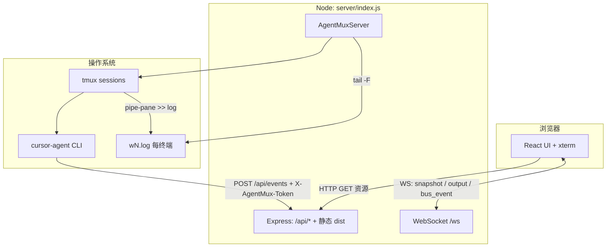

# AgentMux-Mac 项目架构说明

本文档描述本仓库（`agentmux-mac`）的**实际实现**架构：基于 Node.js、tmux、WebSocket 与 React/xterm 的多终端编排与 Cursor CLI `agent` 集成。若需通用概念背景，可对照 [`AgentMux_Technical_Architecture_Documentation.md`](./AgentMux_Technical_Architecture_Documentation.md)（偏目标与组件清单）；本文以**代码与目录**为准。

---

## 1. 项目定位

**AgentMux-Mac** 在浏览器中提供 Web UI，用于：

- 为每个「工作区目录」创建 **Project**，每个 Project 下挂多个 **Terminal**（对应独立 **tmux session**）。
- 每个 Terminal 内自动启动 **Cursor CLI `agent`**，并注入可配置的 **bootstrap 指令**（含事件总线 HTTP 上报约定）。
- 通过 **WebSocket** 将终端输出实时推到前端 **xterm.js**；通过 **HTTP API** 接收 agent 侧 `POST /api/events`，实现**事件总线**与跨终端协作。

底层假设：**本机已安装 `tmux`**，且 `agent` 可在 `PATH` 中解析（或通过 `AGENT_BIN` 指定）。

---

## 2. 技术栈一览

| 层级 | 技术 |
|------|------|
| 前端 | React 19、Vite 8、xterm.js 5、xterm-addon-fit |
| 后端 | Node.js ≥18、Express 4、`ws`（WebSocket） |
| 进程编排 | `tmux`（`new-session`、`send-keys`、`capture-pane`、`pipe-pane`、`kill-session`） |
| 日志与流式输出 | `tail -F -n 0` 跟随每终端日志文件 |
| 静态资源 | 生产环境由 Express 托管 `dist/`（`npm run build` 产物） |

---

## 3. 高层架构

**要点：**

- **实时输出**：tmux 面板输出经 `pipe-pane` 写入日志文件，服务端用 `tail -F` 仅转发**新字节**到浏览器（避免全量重放破坏 TUI）。
- **切换/刷新时的画面**：使用 `tmux capture-pane -p -e -J` 获取带 ANSI 的当前帧（见 `request_snapshot`），而非重放历史日志。
- **事件总线**：浏览器或 agent 通过 HTTP / WebSocket 投递事件，服务端合并进 Project 的 `history` 并广播 `bus_event`。

---

## 4. 目录与职责

| 路径 | 职责 |
|------|------|
| `server/index.js` | HTTP + WebSocket 入口；`AgentMuxServer`：Project/Terminal 生命周期、tmux、tail、capture、事件广播与持久化 |
| `server/instruction.js` | 加载 `config/agent-instruction.md`（或环境变量覆盖）；合并 `extra-instruction.md`；生成 `run_agent_<n>.sh`（heredoc 注入 prompt） |
| `config/agent-instruction.md` | 全局 agent 引导模板；占位符由 `instruction.expandTemplate` 展开，与 `buildPromptVars` 一致：`{{PORT}}`、`{{GROUP_ID}}`、`{{CWD}}`、`{{SESSION_ID}}`、`{{API_BASE}}` |
| `src/App.jsx` | 主 UI：项目树、终端侧栏、xterm、事件总线展示、WebSocket 协议处理 |
| `src/main.jsx` / `src/styles.css` | 入口与全局样式 |
| `vite.config.mjs` | 开发服务器与 `dist` 构建 |
| `index.html` | Vite 入口 HTML |
| `public/` | 历史/备用静态文件（当前主流程以 Vite `src/` + `dist/` 为主） |
| `run.sh` | 构建前端、后台启动 `node server/index.js`，写 `.agentmux.pid` 与 `agentmux.log` |
| `dist/` | `npm run build` 输出；`npm start` 依赖其存在 |

**用户态持久数据（仓库外）：**

- `~/.agentmux/projects.json`：Project 与终端元数据、事件历史摘要。
- `~/.agentmux/projects/<projectId>/`：该 Project 的 `extra-instruction.md`、`run_agent_*.sh`、各终端 `wN.log`。

---

## 5. 后端核心：`AgentMuxServer`

### 5.1 领域模型

- **ProjectSession**：`id`（即 `groupId`）、`cwd`、`name`、`baseDir`（`~/.agentmux/projects/<id>`）、`terminals[]`、`history[]`。
- **TerminalSession**：`id`、`index`、`label`、`name`（tmux session 名，如 `amux_<projectId>_<index>_<uuid>`）、`logPath`。

### 5.2 创建与恢复

- **新建**：`createProject(cwd, count)` 为每个终端调用 `_spawnTerminal`：创建 tmux session、配置 `pipe-pane`、启动 `tail`、写入并执行 bootstrap 脚本。
- **恢复**：启动时 `restoreFromDisk()` 读取 `projects.json`；若 tmux session 已不存在则按启动路径重建并重新注入 agent。

### 5.3 刻意行为：终端尺寸

- tmux session **使用默认 pane 尺寸**（代码注释：约 80×24），**不向 tmux 同步浏览器 xterm 的行列**（`resizeTerminal` 为空操作），以避免 Cursor agent TUI 在 SIGWINCH 后出现大块反色条等问题。
- 前端将 xterm **固定为与 tmux 一致**的列行（`App.jsx` 中 `TMUX_PANE_COLS` / `TMUX_PANE_ROWS`），保证显示与后端一致。

### 5.4 HTTP 路由摘要

| 方法 | 路径 | 说明 |
|------|------|------|
| GET | `/api/health` | 健康检查；**HTTP JSON**，含 `ok`、`agentBin`、`projects`。与 WebSocket 首条 `snapshot` 一样都带项目快照，但**载体不同**（REST vs WS），字段以各自响应为准 |
| GET | `/api/projects` | 项目列表 |
| GET | `/api/system/roots` | 目录选择器根路径 |
| GET | `/api/system/directories` | 目录枚举（`path` 查询参数） |
| GET | `/api/projects/:projectId/tree` | 工作区内目录列表（`path` 为项目相对路径；单目录条目最多 `TREE_ENTRY_LIMIT`，默认 200） |
| GET | `/api/projects/:projectId/file` | 读取工作区内单个文件（`path` 必填，项目相对路径）。JSON 含 `content`（UTF-8）、`truncated`；单文件最多 **256KB**，超出截断 |
| POST | `/api/events` | 事件总线；请求体需含 `projectId` 或 `groupId`。鉴权：`X-AgentMux-Token` 头，或查询参数 `token`（与头等价） |
| GET | `*` | 未命中上述路由且非 `dist` 内已有静态文件时，SPA 回退到 `dist/index.html`（需已构建） |

生产环境托管 `dist/` 时，Express 先 `express.static(DIST_DIR)` 再注册 `GET *`，因此带扩展名的构建资源（如 `assets/*.js`）直接走静态文件，**不会**误落到 SPA。

### 5.5 WebSocket（`/ws`）消息类型（节选）

**客户端 → 服务端：** `create_project`、`add_terminal`、`input`、`request_snapshot`、`emit_event`（浏览器向总线发事件）、`rename_terminal`、`close_terminal`、`delete_project`、`resize`（服务端忽略尺寸）等。

**服务端 → 客户端：** `snapshot`、`output`、`bus_event`、`terminal_snapshot`、`project_created`、`terminal_added`、`error` 等。

---

## 6. Agent 引导与事件上报

1. `instruction.js` 读取模板与 `~/.agentmux/projects/<id>/extra-instruction.md`，按 **§4** 中 `config/agent-instruction.md` 一行所列占位符展开（`{{PORT}}`、`{{GROUP_ID}}` 等；变量名与模板内 `{{…}}` 须一致）。
2. `writeAgentBootstrapScript` 生成 `run_agent_<index>.sh`：导出 `AGENTMUX_GROUP_ID`、`AGENTMUX_SESSION_ID`、`AGENTMUX_API_BASE`、`AGENTMUX_TOKEN`，并以 heredoc 将完整 prompt 传给 `agent`（默认附加 `--yolo`，可通过 `AGENTMUX_AGENT_FLAGS` 调整）。
3. Agent 通过 `curl` 或等价方式 **仅经 HTTP** 上报 `done` / `require_confirmation` 等事件；**终端纯文本不会自动进入总线**。

---

## 7. 事件总线（`emitEvent`）

- 入参可包含：`type`、`from`、`to`、`text`、`payload`、`appendEnter`。
- 事件写入对应 Project 的 `history`（最多保留约 200 条），并 **broadcast** `bus_event` 给所有 WebSocket 客户端。
- **`to` 路由规则（易踩坑）：** 服务端用 `terminals.find((term) => term.id === to)` 解析目标。**`to` 必须是该终端的 `id`（快照里每条终端的短 id）**，不能用 tmux session 名。匹配失败时事件仍会进 `history` 并广播，但**不会**向任何 pane 注入按键或 curl。
- 若 `to` 解析成功：
  - `text` 有值：向该 tmux 会话 **注入按键**（`appendEnter` 默认 `true` 时末尾补 Enter）。
  - `text` 省略：向目标注入一条 **curl**，把同一条事件再 `POST` 到 `/api/events`（用于跨 pane 触发）。
- **`from`：** HTTP 未带 `from` 时记为 `"http"`；浏览器经 WS 发事件时源为 `"browser"`。agent 侧常用 `AGENTMUX_SESSION_ID`（tmux 名）作为 `from` 展示来源；与 `to` 不同，`from` **不参与**目标解析。

---

## 8. 配置与环境变量

| 变量 | 作用 |
|------|------|
| `PORT` / `HOST` | HTTP 监听（默认 `9988`、`0.0.0.0`） |
| `AGENTMUX_TOKEN` | 与 `POST /api/events` 的 `X-AgentMux-Token` 一致；默认不安全占位，生产务必修改 |
| `AGENT_BIN` | 覆盖 `agent` 可执行路径 |
| `AGENTMUX_AGENT_INSTRUCTION_FILE` | 覆盖全局 instruction 模板文件路径 |
| `AGENTMUX_AGENT_FLAGS` | 未设置时默认 `--yolo`；设为空字符串则不加额外参数（恢复逐步确认） |

---

## 9. 构建与运行

| 命令 | 说明 |
|------|------|
| `npm run dev` | Vite 开发服务器（默认 5173），需自行另启 `node server/index.js` 若要对全栈联调 |
| `npm run build` | 产出 `dist/` |
| `npm start` | 仅启动 `server/index.js`（需已有 `dist`） |
| `./run.sh` | 构建 + 后台启动服务，日志 `agentmux.log` |
| `npm run dev:server` | 仅启动 `node server/index.js`（与 `npm start` 相同脚本），常与 `npm run dev` 分两个终端联调 |

---

## 10. 文档与实现的补充说明（待读者留意的改进点）

前文各节已覆盖主路径；下列条目来自对 `server/index.js` 等与本文的对照，避免读文档时踩坑。

### 10.1 健康检查：`/api/health` 与根路径

- **JSON 健康与项目快照**仅 **`GET /api/health`**（返回 `ok`、`agentBin`、`projects` 等）。
- 根路径 **`/health`**、**`/status`** 等**未**在 Express 中单独注册为 JSON；若请求未命中 `dist` 下的静态文件，会落入 **`GET *`** SPA 回退，可能返回 **`index.html` 且 HTTP 200**，易被误判为「健康接口」。监控与自动化脚本应固定请求 **`/api/health`**。
- `/api/health` 体带项目列表快照，若极高频轮询会增加负载；生产环境建议合理间隔或使用专用探活逻辑。

### 10.2 两处「200」上限勿混淆

- **事件总线 `history`**：服务端与前端展示均按约 **200 条**截断（见 `serializeProject` / 前端 `slice(-200)`）。
- **目录树 API**：`listTreeEntries` 受 **`TREE_ENTRY_LIMIT`（200）** 约束，指**单目录下列出的条目数**，与事件条数无关。超大目录下列表可能不完整。

### 10.3 与 [`AgentMux_Technical_Architecture_Documentation.md`](./AgentMux_Technical_Architecture_Documentation.md) 的衔接

- 产品级背景以该文档为准；**本仓库目录与路由以本文 §4、§5 及本节为准**。若技术总览中未提及 `file` 路由或 `dev:server`，以本文与源码为准。

---

## 11. 相关文档

- [`AgentMux_Technical_Architecture_Documentation.md`](./AgentMux_Technical_Architecture_Documentation.md) — 产品级目标与组件说明（与 WSL 文档同源风格）。
- [`run-sh.md`](./run-sh.md) — `run.sh` 行为说明。
- [`terminal-sidebar-layout.md`](./terminal-sidebar-layout.md) — 终端侧栏布局相关笔记。

---

*文档版本：与仓库实现同步撰写；若行为以 `server/index.js` 为准。*
