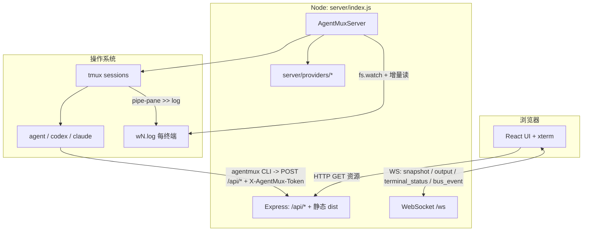

# AgentMux 项目架构说明

[English](Project_Architecture.md) · **简体中文**

本文档描述本仓库（`agentmux`）的**实际实现**架构：基于 Node.js、tmux、WebSocket 与 React/xterm 的多终端编排，可同时运行 Cursor Agent、Codex CLI 与 Claude Code。若需通用概念背景，可对照 [`AgentMux_Technical_Architecture_Documentation.zh-CN.md`](./AgentMux_Technical_Architecture_Documentation.zh-CN.md)（偏目标与组件清单）；本文以**代码与目录**为准。

---

## 1. 项目定位

**AgentMux** 在浏览器中提供 Web UI，用于：

- 为每个「工作区目录」创建 **Project**，每个 Project 下挂多个 **Terminal**（对应独立 **tmux session**）。
- 每个 Terminal 启动一个 **agent CLI**，并注入可配置的 **bootstrap 指令**。**CLI 与模型是每终端独立选择的**——同一个 Project 里可以一个 pane 跑 Claude、一个跑 Codex、一个跑 Cursor。
- 通过 **WebSocket** 将终端输出推到前端 **xterm.js**；通过 **HTTP API** 接收 agent 侧上报，实现**事件总线**与跨终端协作。

底层假设：**本机已安装 `tmux`**，且至少一个 agent CLI 可在 `PATH` 中解析（`agent` / `codex` / `claude`，或通过环境变量指定路径）。

无原生模块依赖，macOS 与 Linux 均可运行。

---

## 2. 技术栈一览

| 层级 | 技术 |
|------|------|
| 前端 | React 19、Vite 8、xterm.js 5、xterm-addon-fit |
| 后端 | Node.js ≥18、Express 4、`ws`（WebSocket） |
| 进程编排 | `tmux`（`new-session`、`send-keys`、`capture-pane`、`pipe-pane`、`display-message`、`kill-session`） |
| 日志与流式输出 | `fs.watch` + 80ms 轮询，`fs.readSync` 增量读取每终端日志文件 |
| 静态资源 | 生产环境由 Express 托管 `dist/`（`npm run build` 产物） |

---

## 3. 高层架构



**要点：**

- **实时输出**：tmux 面板输出经 `pipe-pane` 写入日志文件，服务端增量读取并只转发**新字节**（避免全量重放破坏 TUI）。
- **只发给在看的人**：`output` 消息仅推送给**订阅了该终端**的客户端（见 §7）。
- **切换/刷新时的画面**：使用 `tmux capture-pane -p -e -J` 获取带 ANSI 的当前帧（见 `request_snapshot`），而非重放历史日志。
- **活动状态独立通道**：每秒对每个 pane 的渲染帧取哈希判断忙/闲，只在状态跳变时广播 `terminal_status`（见 §7）。

---

## 4. 目录与职责

| 路径 | 职责 |
|------|------|
| `server/index.js` | HTTP + WebSocket 入口；`AgentMuxServer`：Project/Terminal 生命周期、tmux、日志流、capture、状态轮询、事件广播与持久化 |
| `server/providers/` | agent CLI 抽象。`base.js`（bootstrap 脚本模板 + CLI wrapper 安装）、`cursor.js` / `codex.js` / `claude.js`、`index.js`（注册表与 `normalizeCli`） |
| `server/instruction.js` | 加载 `config/agent-instruction.md`（或环境变量覆盖）；合并 `extra-instruction.md`；组装最终 prompt |
| `cli/index.js` | `agentmux` 命令，供 pane 内的 agent 调用（上报事件、驱动其他 pane） |
| `config/agent-instruction.md` | 全局 agent 引导模板；占位符由 `expandTemplate` 展开，与 `buildPromptVars` 一致：`{{PORT}}`、`{{GROUP_ID}}`、`{{CWD}}`、`{{SESSION_ID}}`、`{{API_BASE}}` |
| `src/App.jsx` | 主 UI：项目树、终端侧栏、xterm、事件日志、设置、新建终端对话框、WebSocket 协议处理 |
| `src/main.jsx` / `src/styles.css` | 入口与全局样式 |
| `vite.config.mjs` / `index.html` | 构建配置与 Vite 入口 |
| `run.sh` | 构建前端、后台启动 `node server/index.js`，写 `.agentmux.pid` 与 `agentmux.log` |

**用户态持久数据（仓库外）：**

- `~/.agentmux/projects.json`：Project 与终端元数据（含每终端的 `cli` / `model`）、事件历史摘要、全局 settings。
- `~/.agentmux/settings.json`：语言与新建终端的默认 CLI / 模型。
- `~/.agentmux/bin/agentmux`：注入 agent pane `PATH` 的 CLI wrapper，每次 spawn 重写。
- `~/.agentmux/projects/<projectId>/`：该 Project 的 `extra-instruction.md`、`run_agent_*.sh`、各终端 `wN.log`。

---

## 5. 后端核心：`AgentMuxServer`

### 5.1 领域模型

- **ProjectSession**：`id`（即 `groupId`）、`cwd`、`name`、`baseDir`（`~/.agentmux/projects/<id>`）、`roots[]`、`terminals[]`、`history[]`。
- **TerminalSession**：`id`、`index`、`label`、`name`（tmux session 名，如 `amux_<projectId>_<index>_<uuid>`）、`logPath`、**`cli`**、**`model`**、`status`、`frameHash`、`attention`。

`cli` / `model` **存在终端上而非全局**：终端创建时选定并持久化，服务重启后按各自的 provider 重建，改全局默认不会影响已有终端。

### 5.2 创建与恢复

- **新建**：`createProject(cwd, initialCount, name)` 为每个终端调用 `_spawnTerminal(project, index, choice)`：创建 tmux session、配置 `pipe-pane`、启动日志流、写入并执行 bootstrap 脚本。`choice` 缺省时取全局 settings。
- **恢复**：启动时 `restoreFromDisk()` 读取 `projects.json`；tmux session 仍在则重新挂日志管道，已消失则**按该终端自己的 `cli` / `model`** 重建。

### 5.3 刻意行为：终端尺寸

- tmux session **使用默认 pane 尺寸**（约 80×24），**不向 tmux 同步浏览器 xterm 的行列**（`resizeTerminal` 为空操作），以避免 agent TUI 在 SIGWINCH 后出现大块反色条等问题。
- 前端将 xterm **固定为与 tmux 一致**的列行（`App.jsx` 中 `TMUX_PANE_COLS` / `TMUX_PANE_ROWS`）。

### 5.4 刻意行为：`pipe-pane` 不带 `-o`

`pipe-pane -o` 是**开关**（手册："only opens a new pipe if no previous pipe exists, allowing a pipe to be toggled"）。对已在 pipe 的 pane 再调一次会**关闭**管道，该终端从此对浏览器静默。不带 `-o` 时调用是幂等的。状态轮询每 5 次顺带检查 `#{pane_pipe}`，掉了自动重建并推一帧快照。

### 5.5 日志回收

每终端日志是**增量传输缓冲，不是归档**：字节推送后不再回放（新客户端从 `capture-pane` 取当前帧，已收到的字节在各自 xterm 滚动历史里）。因此超过 `AGENTMUX_LOG_MAX_BYTES`（默认 2MB）即截断。截断只在读取位置追平时进行。

这不是可选优化：空闲的 Claude Code pane 会持续重绘 TUI，实测约 3KB/s，即每终端每天约 280MB。

---

## 6. HTTP 路由

| 方法 | 路径 | 鉴权 | 说明 |
|------|------|------|------|
| GET | `/api/health` | — | 健康检查；含 `ok`、`agentBin`、`settings`、`projects` |
| GET | `/api/projects` | — | 项目列表 |
| GET | `/api/providers` | — | 可用 agent CLI 及各自默认模型 |
| GET | `/api/settings/model-options` | — | 指定 CLI 的模型列表（`cli` 查询参数） |
| GET | `/api/system/roots` | — | 目录选择器根路径 |
| GET | `/api/system/directories` | — | 目录枚举（`path` 查询参数） |
| POST | `/api/system/directories` | — | 在浏览到的目录下新建子目录（`name` 必须是单个路径段） |
| GET | `/api/projects/:projectId/tree` | — | 工作区内目录列表；单目录条目最多 `TREE_ENTRY_LIMIT`（200） |
| GET | `/api/projects/:projectId/file` | — | 读取工作区内单个文件；最多 **256KB**，超出截断 |
| GET | `/api/terminals` | Token | 列出所有 pane（跨 Project） |
| POST | `/api/terminals/:ref/run` | Token | 向 pane 输入一条命令 |
| GET | `/api/terminals/:ref/output` | Token | 读回 pane 滚动屏，已剥离 ANSI |
| POST | `/api/terminals/:ref/interrupt` | Token | 向 pane 发 `C-c` |
| POST | `/api/events` | Token | 事件总线；请求体需含 `projectId` 或 `groupId` |
| GET | `*` | — | SPA 回退到 `dist/index.html`（需已构建） |

「Token」指 `X-AgentMux-Token` 头或 `token` 查询参数，值为 `AGENTMUX_TOKEN`。

`:ref` 可以是终端 `id`、tmux session 名，或终端标签（如 `Agent 2`）。标签查找优先限定在调用方自己的 Project 内。

**注意**：Web UI 与 WebSocket **本身没有任何鉴权**，Token 只保护上表中标注的 agent 面向端点。

---

## 7. WebSocket（`/ws`）

**客户端 → 服务端：** `create_project`、`add_terminal`、`input`、`request_snapshot`、`emit_event`、`rename_terminal`、`close_terminal`、`delete_project`、`add_project_root`、`remove_project_root`、`update_settings`、`subscribe_terminal`、`resize`（服务端忽略尺寸）。

**服务端 → 客户端：** `snapshot`、`output`、`terminal_status`、`bus_event`、`terminal_snapshot`、`project_created`、`project_existing`、`project_deleted`、`project_root_added`、`project_root_removed`、`project_tree_changed`、`terminal_added`、`terminal_renamed`、`terminal_closed`、`terminal_input`、`settings_updated`、`error`。

### 7.1 内容订阅

`subscribe_terminal` 声明该连接当前显示哪个终端，`output` 只发给匹配的客户端。**从未订阅过的连接仍收到全部输出**（兼容旧客户端）。

隐藏 pane 的字节对客户端无用——切换过去时会用 `capture-pane` 整帧重绘。N 个 pane 全量广播等于把流量乘以 N。

### 7.2 活动状态

`terminal_status` 携带 `idle` / `working` / `waiting`，**只在跳变时发送**。

判定依据是**渲染帧的哈希**，不是字节量：空闲的 Claude Code pane 一直在重绘，空闲的 Codex pane（`--no-alt-screen`）一个字节都不发，字节量无法区分二者。帧哈希连续 `WORKING_GRACE_MS`（3s）不变即判为 idle。

`require_confirmation` 事件会把终端置为 `waiting`（优先级最高），由该终端后续的 `done` / `status` / `agent_reply` 清除。帧哈希不依赖 agent 配合，所以 agent 不上报时最坏只是退化为忙/闲，不会给出错误的「等待中」。

---

## 8. Agent 引导与事件上报

1. `instruction.js` 读取模板与 `~/.agentmux/projects/<id>/extra-instruction.md`，展开 §4 所列占位符。
2. provider 的 `buildBootstrapScript` 生成 `run_agent_<index>.sh`：导出 `AGENTMUX_GROUP_ID`、`AGENTMUX_SESSION_ID`、`AGENTMUX_TERMINAL_ID`、`AGENTMUX_API_BASE`、`AGENTMUX_TOKEN`，把 `~/.agentmux/bin` 加入 `PATH`，并以 heredoc 将完整 prompt 传给对应 CLI。
3. Agent 用 `agentmux` 命令上报，**终端纯文本不会自动进入总线**：

   ```sh
   agentmux event --type done --summary "..."
   printf '%s' "$REPORT" | agentmux event --type done --summary -   # 多行/含引号
   ```

各 provider 的默认参数：

| CLI | 默认参数 | 覆盖变量 |
|-----|---------|---------|
| Cursor Agent | `--yolo` | `AGENTMUX_AGENT_FLAGS` |
| Codex CLI | `--no-alt-screen --dangerously-bypass-approvals-and-sandbox`，reasoning effort 取自模型目录 | （固定） |
| Claude Code | `--permission-mode bypassPermissions` | `AGENTMUX_CLAUDE_FLAGS` |

模型列表来源：Cursor 与 Codex 从 CLI 动态读取（`agent --list-models` / `codex debug models`，均缓存 5 分钟）；Claude Code 没有列模型的命令，使用 `opus` / `sonnet` / `haiku` / `fable` 别名——这些由 CLI 自行解析到当前版本，不会过期。

Claude 首次进入新目录会弹信任对话框，而 tmux pane 里无人应答，因此 spawn 前会在 `~/.claude.json` 预先标记该目录为已信任。

---

## 9. 事件总线（`emitEvent`）

- 入参可包含：`type`、`from`、`to`、`text`、`payload`、`appendEnter`。
- **先记录再路由**：事件先写入 Project 的 `history`（保留约 200 条）并 broadcast `bus_event`，之后才尝试投递。**没有 `to` 的事件是给操作者看的上报**（文档中 `done` 的标准形态就没有 `to`），必须进事件日志。
- `to` 的解析走 `resolveTerminalRef`，依次匹配终端 `id`、tmux session 名、标签。
- 若 `to` 解析成功：
  - `text` 有值：向该 tmux 会话 **注入按键**（`appendEnter` 默认 `true` 时末尾补 Enter）。
  - `text` 省略：向目标注入一条 **curl**，把同一条事件再 `POST` 到 `/api/events`（用于跨 pane 触发）。
- `type` 为 `terminal_input` 时是裸键盘透传，不计入事件日志。
- **`from`：** HTTP 未带 `from` 时记为 `"http"`；浏览器经 WS 发事件时源为 `"browser"`。`from` 会用于更新该终端的 `waiting` 状态（见 §7.2）。

---

## 10. 配置与环境变量

| 变量 | 作用 |
|------|------|
| `PORT` / `HOST` | HTTP 监听（默认 `9988`、`0.0.0.0`） |
| `AGENTMUX_TOKEN` | agent 面向端点的鉴权；默认是不安全占位值，务必修改 |
| `AGENT_BIN` / `AGENTMUX_CODEX_BIN` / `AGENTMUX_CLAUDE_BIN` | 覆盖各 CLI 可执行路径 |
| `AGENTMUX_AGENT_FLAGS` / `AGENTMUX_CLAUDE_FLAGS` | 替换该 provider 的默认参数；设为空字符串则不加额外参数（恢复逐步确认） |
| `AGENTMUX_LOG_MAX_BYTES` | 每终端日志上限（默认 2MB，最低 64KB） |
| `AGENTMUX_AGENT_INSTRUCTION_FILE` | 覆盖全局 instruction 模板文件路径 |

---

## 11. 构建与运行

| 命令 | 说明 |
|------|------|
| `npm run dev` | Vite 开发服务器（默认 5173），全栈联调需另启 `node server/index.js` |
| `npm run build` | 产出 `dist/` |
| `npm start` | 仅启动 `server/index.js`（需已有 `dist`） |
| `npm run dev:server` | 同 `npm start`，常与 `npm run dev` 分两个终端联调 |
| `./run.sh` | 构建 + 后台启动服务，日志 `agentmux.log` |

`run.sh` 用 `lsof` 清理端口占用，部分精简 Linux 镜像未预装（`apt install lsof`，或直接 `node server/index.js`）。

---

## 12. 易踩坑

### 12.1 健康检查只认 `/api/health`

根路径 `/health`、`/status` **未**注册为 JSON 路由；未命中 `dist` 静态文件时会落入 `GET *` SPA 回退，返回 **`index.html` 且 HTTP 200**，易被误判为「健康接口」。监控脚本应固定请求 `/api/health`。

该响应体带项目列表快照，高频轮询会增加负载。

### 12.2 两处「200」勿混淆

- **事件 `history`**：服务端与前端展示均按约 **200 条**截断。
- **目录树 API**：`TREE_ENTRY_LIMIT`（200）指**单目录下列出的条目数**，与事件条数无关。超大目录列表可能不完整。

---

## 13. 相关文档

- [`AgentMux_Technical_Architecture_Documentation.md`](./AgentMux_Technical_Architecture_Documentation.md) — 产品级目标与组件说明。
- [`run-sh.zh-CN.md`](./run-sh.zh-CN.md) — `run.sh` 行为说明。
- [`terminal-sidebar-layout.zh-CN.md`](./terminal-sidebar-layout.zh-CN.md) — 终端侧栏布局笔记（历史文档）。

---

*本文以 `server/index.js` 等源码为准；行为如有出入，以代码为准。*
